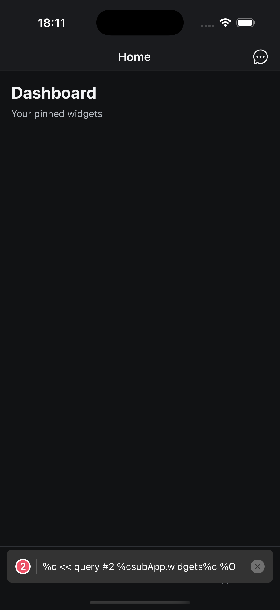

# Current Work: Mobile Shell POC

## Goal

Add a minimal Expo app shell that opens in Expo Go on a phone. The POC should prove the navigation shell and a global chat surface that remains accessible from every screen.

## Branch

`mobile`

## Package Shape

Create a separate mobile package under `packages/`, likely `packages/mobile` with package name `@rho/mobile`. Keep it independent from `@rho/cli` so CLI installs do not pull React Native or Expo dependencies.

## Minimal Dependency Set

Use Expo Router with React Native only. Include the essentials needed for Expo Go routing and safe rendering: `expo`, `expo-router`, `react`, `react-native`, `react-native-safe-area-context`, `react-native-screens`, `expo-status-bar`, and TypeScript/React types. Avoid auth, backend clients, query clients, Tailwind wrappers, webviews, device bridges, push notifications, and persistent storage for this POC.

## App Structure

- `app/_layout.tsx`: root layout, global providers, stack router, global chat overlay.
- `app/(tabs)/_layout.tsx`: tab router with native tab UI hidden; headers stay visible.
- `app/(tabs)/index.tsx`: Home placeholder.
- `app/(tabs)/discover.tsx`: Discover placeholder.
- `app/(tabs)/apps.tsx`: Apps placeholder.
- `app/sub-app/[id].tsx`: placeholder detail/sub-app screen.
- `providers/chat-state-provider.tsx`: global chat open/closed state and message list.
- `components/chat/*`: header button, overlay/panel, message list, input.
- `components/navigation/bottom-bar.tsx`: simple bottom nav for Home, Discover, Apps.

## UI Behavior

The root layout wraps all screens in `ChatStateProvider`. Every primary screen should show a header chat button. Pressing it opens a full-screen or card-style chat panel above the current route. The chat panel should include a header, scrollable message list, text input, and close action. Sending a message appends the user message and a local `echo: ...` assistant response. The active route should remain mounted behind the chat.

## Navigation Behavior

Use Expo Router for routes. Hide the default tab bar and render a custom bottom bar below the content. Bottom tabs navigate between Home, Discover, and Apps. The sub-app route can show a placeholder title and id. Bottom bar can remain simple; if it becomes awkward on sub-app routes, use a placeholder “Sub-app running” bar.

## Visual Scope

Use plain React Native styles with a small local theme file if helpful. Keep the look clean but not polished: light/dark colors, safe-area padding, readable cards, and obvious buttons. Do not add icon/font packages unless needed; text labels are enough for the POC.

## Visual Reference

Captured from the reference shell in iOS Simulator:

Distilled visual requirements from the screenshot:

- Dark-mode safe-area layout with native status bar area preserved.
- Centered route title in the header.
- Chat button in the top-right header area, visible on the Home screen.
- Main content starts below the header with a large page title and muted subtitle.
- Large empty content area is acceptable for the POC placeholders.
- Bottom navigation area should be reserved below content, even if the POC uses simpler labels/buttons.

## Non-goals

- Real auth, backend, tRPC/query clients, persistence, webviews, device APIs, push notifications, or production-grade navigation polish.
- Wiring chat to `@rho/ai`, coding-agent tasks, or channel backends.
- Sharing dependencies with `@rho/cli`.

## Validation

- `bun install` resolves the workspace.
- `bun run check` still passes for existing packages.
- Mobile package has scripts such as `dev`, `ios`, `android`, and `typecheck`.
- `bun --cwd packages/mobile run dev` starts Expo.
- In Expo Go, Home/Discover/Apps navigate, sub-app placeholder opens if linked, and global chat opens from screens and echoes messages.

## Progress

- [x] Created branch and initialized plan.
- [x] Distilled mobile shell structure and global chat requirements.
- [ ] Add minimal Expo package/config.
- [ ] Add root layout, placeholder routes, bottom nav, and global chat shell.
- [ ] Validate typecheck/build scripts and Expo startup instructions.
